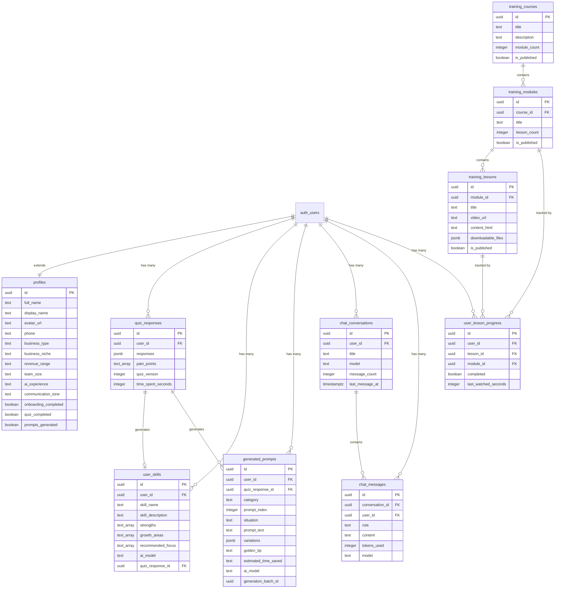

# 🏗️ Backend Supabase — Funcionalidades Completas

> Mapeamento **exaustivo** de tudo que precisa ser criado/configurado no Supabase para o app **EXECUTIVOS**.

---

## 📋 Índice

1. [Autenticação (Auth)](#1-autenticação-auth)
2. [Banco de Dados — Tabelas e Relacionamentos](#2-banco-de-dados--tabelas-e-relacionamentos)
3. [Row Level Security (RLS)](#3-row-level-security-rls)
4. [Triggers e Functions](#4-triggers-e-functions)
5. [Edge Functions (Serverless)](#5-edge-functions-serverless)
6. [System Prompts (Configuração IA)](#6-system-prompts-configuração-ia)
7. [Storage Buckets](#7-storage-buckets)
8. [Configurações de Segurança](#8-configurações-de-segurança)
9. [Diagrama de Relacionamentos](#9-diagrama-de-relacionamentos)
10. [Checklist de Implementação](#10-checklist-de-implementação)

---

## 1. Autenticação (Auth)

### 1.1 Métodos de Auth Necessários

| Método | Status | Onde é usado |
|--------|--------|--------------|
| `signUp(email, password, fullName)` | ✅ Implementado no front | `RegisterForm.tsx` |
| `signInWithPassword(email, password)` | ✅ Implementado no front | `LoginForm.tsx` |
| `signOut()` | ✅ Implementado no front | `ProfilePage.tsx` |
| `resetPasswordForEmail(email)` | ✅ Implementado no front | `LoginForm.tsx` (link "Esqueceu a senha?") |
| `getSession()` | ✅ Implementado no front | `AuthContext.tsx` |
| `onAuthStateChange()` | ✅ Implementado no front | `AuthContext.tsx` |

### 1.2 O que configurar no Supabase Dashboard

| Configuração | Valor Recomendado | Notas |
|---|---|---|
| **Site URL** | `https://seudominio.com.br` | URL de redirecionamento após confirmação de email |
| **Redirect URLs** | `https://seudominio.com.br/login`, `http://localhost:5173/login` | Permitir dev + prod |
| **Email Auth** | ✅ Habilitado | Método principal |
| **Confirm Email** | ✅ Habilitado | Enviar email de confirmação |
| **Secure email change** | ✅ Habilitado | Verificação dupla |
| **Minimum password length** | `6` | Definido no `RegisterForm` como `minLength={6}` |
| **Rate Limiting** | Default (4 signups/hour por IP) | Proteger contra abuse |

### 1.3 Templates de Email a Customizar

| Template | Para que serve | Customizar? |
|---|---|---|
| **Confirm signup** | Email após criar conta | ✅ Sim — português, branding EXECUTIVOS |
| **Reset password** | Recuperação de senha | ✅ Sim — português |
| **Magic Link** | Login sem senha (futuro) | ⬜ Opcional |
| **Change Email** | Troca de email | ✅ Sim — português |

### 1.4 Metadata de Usuário

No `signUp`, o `full_name` é passado via `options.data`:
```typescript
await supabase.auth.signUp({
  email, password,
  options: { data: { full_name: fullName } }
})
```

Esse `full_name` é acessível em `auth.users.raw_user_meta_data->>'full_name'` e usado no trigger `handle_new_user()`.

### 1.5 Proteção de Rotas

O `ProtectedRoute.tsx` verifica se há `session` ativa. Se não, redireciona para `/login`.

> [!IMPORTANT]
> **Ação necessária:** Configurar todos os templates de email em português BR com a identidade visual da EXECUTIVOS (logo, cores #F5C518).

---

## 2. Banco de Dados — Tabelas e Relacionamentos

### 2.1 Visão Geral das Tabelas

| # | Tabela | Descrição | FK Principal | Status |
|---|--------|-----------|--------------|--------|
| 1 | `profiles` | Perfil do usuário (extends auth.users) | `auth.users(id)` | ✅ No schema |
| 2 | `quiz_responses` | Respostas do quiz | `auth.users(id)` | ✅ No schema |
| 3 | `user_skills` | Skill/perfil profissional gerado pela IA | `auth.users(id)`, `quiz_responses(id)` | ✅ No schema |
| 4 | `generated_prompts` | Prompts gerados pela IA | `auth.users(id)`, `quiz_responses(id)` | ✅ No schema |
| 5 | `chat_conversations` | Conversas do chat | `auth.users(id)` | ✅ No schema |
| 6 | `chat_messages` | Mensagens individuais | `auth.users(id)`, `chat_conversations(id)` | ✅ No schema |
| 7 | `training_courses` | Cursos de treinamento | — (admin managed) | ⚠️ FALTA no schema |
| 8 | `training_modules` | Módulos dentro de cursos | `training_courses(id)` | ⚠️ Parcial no schema |
| 9 | `training_lessons` | Aulas dentro de módulos | `training_modules(id)` | ✅ No schema |
| 10 | `user_lesson_progress` | Progresso do usuário nas aulas | `auth.users(id)`, `training_lessons(id)`, `training_modules(id)` | ✅ No schema |

### 2.2 SQL Detalhado — Tabelas que FALTAM criar

#### ⚠️ Tabela `training_courses` (NÃO EXISTE no schema atual)

O front usa `training_courses` (veja `TrainingPage.tsx` linha 38), mas o schema `001_full_schema.sql` **só tem** `training_modules` e `training_lessons`. **Falta criar:**

```sql
-- -------------------------------------------------------
-- training_courses (NOVA — necessária)
-- -------------------------------------------------------
CREATE TABLE training_courses (
  id            UUID PRIMARY KEY DEFAULT gen_random_uuid(),
  title         TEXT NOT NULL,
  description   TEXT,
  thumbnail_url TEXT,
  sort_order    INTEGER DEFAULT 0,
  module_count  INTEGER DEFAULT 0,
  is_published  BOOLEAN DEFAULT FALSE,
  created_at    TIMESTAMPTZ DEFAULT NOW(),
  updated_at    TIMESTAMPTZ DEFAULT NOW()
);

ALTER TABLE training_courses ENABLE ROW LEVEL SECURITY;

CREATE POLICY "Authenticated users can view published courses"
  ON training_courses FOR SELECT
  USING (auth.role() = 'authenticated' AND is_published = TRUE);

CREATE TRIGGER training_courses_updated_at
  BEFORE UPDATE ON training_courses
  FOR EACH ROW
  EXECUTE FUNCTION update_updated_at();
```

#### ⚠️ Tabela `training_modules` — Precisa de FK para `training_courses`

O schema atual tem `training_modules` mas **sem** `course_id`. O front (`TrainingCoursePage.tsx` linha 47) filtra por `course_id`. **Precisa adicionar:**

```sql
ALTER TABLE training_modules 
  ADD COLUMN course_id UUID REFERENCES training_courses(id) ON DELETE CASCADE;

CREATE INDEX idx_training_modules_course_id ON training_modules(course_id);
```

### 2.3 SQL Completo de Cada Tabela Existente

#### Tabela 1: `profiles`

```sql
CREATE TABLE profiles (
  id                     UUID PRIMARY KEY REFERENCES auth.users(id) ON DELETE CASCADE,
  full_name              TEXT,
  display_name           TEXT,
  avatar_url             TEXT,
  phone                  TEXT,
  business_type          TEXT,          -- Ex: "agencia_marketing"
  business_niche         TEXT,          -- Ex: "e-commerce"
  revenue_range          TEXT,          -- Ex: "50k-100k"
  team_size              TEXT,          -- Ex: "5-10"
  ai_experience          TEXT,          -- Ex: "intermediario"
  communication_tone     TEXT,          -- Ex: "profissional"
  onboarding_completed   BOOLEAN DEFAULT FALSE,
  quiz_completed         BOOLEAN DEFAULT FALSE,
  prompts_generated      BOOLEAN DEFAULT FALSE,
  created_at             TIMESTAMPTZ DEFAULT NOW(),
  updated_at             TIMESTAMPTZ DEFAULT NOW()
);
```

**Campos usados no app:**
- `display_name` → Dashboard hero, TopBar, Sidebar, ProfilePage
- `full_name` → Fallback do display_name
- `avatar_url` → Sidebar avatar (placeholder se null)
- `phone` → ProfilePage edição
- `business_type/niche/revenue_range/team_size` → Preenchido pelo Quiz, exibido no ProfilePage
- `quiz_completed` → Controla fluxo Dashboard → Quiz
- `prompts_generated` → Controla exibição dos prompts
- `onboarding_completed` → Demo mode flag

#### Tabela 2: `quiz_responses`

```sql
CREATE TABLE quiz_responses (
  id                 UUID PRIMARY KEY DEFAULT gen_random_uuid(),
  user_id            UUID NOT NULL REFERENCES auth.users(id) ON DELETE CASCADE,
  responses          JSONB NOT NULL,        -- Todas as respostas como JSON
  pain_points        TEXT[] DEFAULT '{}',    -- Array de pain points extraídos
  quiz_version       INTEGER DEFAULT 1,
  time_spent_seconds INTEGER,               -- Tempo que levou no quiz
  completed_at       TIMESTAMPTZ DEFAULT NOW(),
  created_at         TIMESTAMPTZ DEFAULT NOW()
);
```

**Gravado em:** `QuizContainer.tsx` → `processQuiz()` (linha 109-117)

#### Tabela 3: `user_skills`

```sql
CREATE TABLE user_skills (
  id                UUID PRIMARY KEY DEFAULT gen_random_uuid(),
  user_id           UUID NOT NULL REFERENCES auth.users(id) ON DELETE CASCADE,
  skill_name        TEXT NOT NULL,           -- "Estrategista Digital Focado em Escala"
  skill_description TEXT NOT NULL,           -- Descrição do perfil
  strengths         TEXT[],                  -- ["Vendas consultivas", "Marketing"]
  growth_areas      TEXT[],                  -- ["Automação", "Análise financeira"]
  recommended_focus TEXT[],                  -- ["Vendas", "Marketing"]
  ai_model          TEXT NOT NULL,           -- Modelo que gerou
  raw_response      JSONB,                   -- Resposta bruta da IA
  quiz_response_id  UUID REFERENCES quiz_responses(id) ON DELETE SET NULL,
  created_at        TIMESTAMPTZ DEFAULT NOW()
);
```

**Gravado em:** `QuizContainer.tsx` → `processQuiz()` (linhas 121-131)  
**Lido em:** `SkillPage.tsx` (linha 77-83)

#### Tabela 4: `generated_prompts`

```sql
CREATE TABLE generated_prompts (
  id                  UUID PRIMARY KEY DEFAULT gen_random_uuid(),
  user_id             UUID NOT NULL REFERENCES auth.users(id) ON DELETE CASCADE,
  quiz_response_id    UUID REFERENCES quiz_responses(id) ON DELETE SET NULL,
  category            TEXT NOT NULL CHECK (category IN ('vendas','atendimento','marketing','operacional','financeiro')),
  prompt_index        INTEGER,                 -- Posição ordenada
  situation           TEXT NOT NULL,            -- "Proposta comercial personalizada"
  prompt_text         TEXT NOT NULL,            -- O prompt completo
  variations          JSONB DEFAULT '[]',       -- [{context, prompt}]
  golden_tip          TEXT,                     -- Dica de ouro
  estimated_time_saved TEXT,                    -- "45min"
  ai_model            TEXT NOT NULL,
  generation_batch_id UUID,                     -- Agrupa prompts gerados na mesma sessão
  created_at          TIMESTAMPTZ DEFAULT NOW()
);
```

**Gravado em:** `QuizContainer.tsx` → `processQuiz()` (linhas 135-152)  
**Lido em:** `PromptsPage.tsx` (linhas 81-84)

#### Tabela 5: `chat_conversations`

```sql
CREATE TABLE chat_conversations (
  id              UUID PRIMARY KEY DEFAULT gen_random_uuid(),
  user_id         UUID NOT NULL REFERENCES auth.users(id) ON DELETE CASCADE,
  title           TEXT DEFAULT 'Nova conversa',
  model           TEXT DEFAULT 'anthropic/claude-3.5-sonnet',
  message_count   INTEGER DEFAULT 0,
  last_message_at TIMESTAMPTZ,
  created_at      TIMESTAMPTZ DEFAULT NOW(),
  updated_at      TIMESTAMPTZ DEFAULT NOW()
);
```

**CRUD completo em:** `ChatPage.tsx`
- `INSERT` → `createConversation()` (linha 72)
- `SELECT` → `useEffect` load (linha 48)
- `UPDATE` → Via trigger automático `handle_new_chat_message()`
- `DELETE` → `deleteConversation()` (linha 78)

#### Tabela 6: `chat_messages`

```sql
CREATE TABLE chat_messages (
  id              UUID PRIMARY KEY DEFAULT gen_random_uuid(),
  conversation_id UUID NOT NULL REFERENCES chat_conversations(id) ON DELETE CASCADE,
  user_id         UUID NOT NULL REFERENCES auth.users(id) ON DELETE CASCADE,
  role            TEXT NOT NULL CHECK (role IN ('user','assistant','system')),
  content         TEXT NOT NULL,
  tokens_used     INTEGER,
  model           TEXT,
  created_at      TIMESTAMPTZ DEFAULT NOW()
);
```

**Gravado em:** `ChatPage.tsx` → `sendMessage()` (linhas 105, 112)

---

## 3. Row Level Security (RLS)

> [!CAUTION]
> **TODAS as tabelas devem ter RLS habilitado.** Sem isso, qualquer usuário autenticado pode acessar dados de outros usuários.

### Resumo de Policies Necessárias

| Tabela | SELECT | INSERT | UPDATE | DELETE |
|--------|--------|--------|--------|--------|
| `profiles` | ✅ Own only | — (via trigger) | ✅ Own only | — |
| `quiz_responses` | ✅ Own only | ✅ Own only | — | — |
| `user_skills` | ✅ Own only | ✅ Own only | — | — |
| `generated_prompts` | ✅ Own only | ✅ Own only | — | — |
| `chat_conversations` | ✅ Own only | ✅ Own only | ✅ Own only | ✅ Own only |
| `chat_messages` | ✅ Own only | ✅ Own only | — | — |
| `training_courses` | ✅ Authenticated + published | — (admin) | — (admin) | — (admin) |
| `training_modules` | ✅ Authenticated + published | — (admin) | — (admin) | — (admin) |
| `training_lessons` | ✅ Authenticated + published | — (admin) | — (admin) | — (admin) |
| `user_lesson_progress` | ✅ Own only | ✅ Own only | ✅ Own only | — |

### Policies para Admin (Training)

> [!IMPORTANT]
> Para gerenciar cursos/módulos/aulas, crie um **role de admin** ou use policies baseadas em um campo `is_admin` na tabela `profiles`:

```sql
-- Adicionar coluna de admin
ALTER TABLE profiles ADD COLUMN is_admin BOOLEAN DEFAULT FALSE;

-- Policy para admin poder gerenciar cursos
CREATE POLICY "Admins can manage courses"
  ON training_courses FOR ALL
  USING (
    EXISTS (
      SELECT 1 FROM profiles 
      WHERE profiles.id = auth.uid() 
      AND profiles.is_admin = TRUE
    )
  );

-- Repetir para training_modules e training_lessons
CREATE POLICY "Admins can manage modules"
  ON training_modules FOR ALL
  USING (
    EXISTS (
      SELECT 1 FROM profiles 
      WHERE profiles.id = auth.uid() 
      AND profiles.is_admin = TRUE
    )
  );

CREATE POLICY "Admins can manage lessons"
  ON training_lessons FOR ALL
  USING (
    EXISTS (
      SELECT 1 FROM profiles 
      WHERE profiles.id = auth.uid() 
      AND profiles.is_admin = TRUE
    )
  );
```

---

## 4. Triggers e Functions

### 4.1 Triggers Existentes no Schema

| Trigger | Tabela | Evento | Função | O que faz |
|---------|--------|--------|--------|-----------|
| `on_auth_user_created` | `auth.users` | AFTER INSERT | `handle_new_user()` | Cria profile automaticamente |
| `profiles_updated_at` | `profiles` | BEFORE UPDATE | `update_updated_at()` | Atualiza `updated_at` |
| `chat_conversations_updated_at` | `chat_conversations` | BEFORE UPDATE | `update_updated_at()` | Atualiza `updated_at` |
| `on_chat_message_inserted` | `chat_messages` | AFTER INSERT | `handle_new_chat_message()` | Incrementa `message_count` e `last_message_at` |
| `training_modules_updated_at` | `training_modules` | BEFORE UPDATE | `update_updated_at()` | Atualiza `updated_at` |
| `training_lessons_updated_at` | `training_lessons` | BEFORE UPDATE | `update_updated_at()` | Atualiza `updated_at` |
| `user_lesson_progress_updated_at` | `user_lesson_progress` | BEFORE UPDATE | `update_updated_at()` | Atualiza `updated_at` |

### 4.2 Triggers que FALTAM criar

```sql
-- Trigger para training_courses (tabela nova)
CREATE TRIGGER training_courses_updated_at
  BEFORE UPDATE ON training_courses
  FOR EACH ROW
  EXECUTE FUNCTION update_updated_at();

-- Trigger para atualizar module_count em training_courses
CREATE OR REPLACE FUNCTION handle_module_count()
RETURNS TRIGGER AS $$
BEGIN
  IF TG_OP = 'INSERT' THEN
    UPDATE training_courses SET module_count = module_count + 1
    WHERE id = NEW.course_id;
  ELSIF TG_OP = 'DELETE' THEN
    UPDATE training_courses SET module_count = module_count - 1
    WHERE id = OLD.course_id;
  END IF;
  RETURN COALESCE(NEW, OLD);
END;
$$ LANGUAGE plpgsql SECURITY DEFINER;

CREATE TRIGGER on_module_change
  AFTER INSERT OR DELETE ON training_modules
  FOR EACH ROW
  EXECUTE FUNCTION handle_module_count();
```

### 4.3 Funções Existentes

| Função | Tipo | Descrição |
|--------|------|-----------|
| `update_updated_at()` | Utility | Reutilizável para qualquer tabela com `updated_at` |
| `handle_new_user()` | SECURITY DEFINER | Cria profile com `full_name` do metadata |
| `handle_new_chat_message()` | SECURITY DEFINER | Atualiza stats da conversa |

---

## 5. Edge Functions (Serverless)

> [!WARNING]
> **Atualmente, as chamadas à API do OpenRouter são feitas diretamente do frontend**, expondo a API key no browser. **Isso é um risco de segurança crítico.** As Edge Functions abaixo devem ser criadas para mover essa lógica para o servidor.

### 5.1 Edge Function: `generate-skill`

**Propósito:** Recebe as respostas do quiz e retorna o perfil Skill gerado pela IA.

```
Caminho: supabase/functions/generate-skill/index.ts
Método: POST
Auth: Bearer token (JWT do Supabase)
```

```typescript
// supabase/functions/generate-skill/index.ts
import { serve } from 'https://deno.land/std@0.168.0/http/server.ts'
import { createClient } from 'https://esm.sh/@supabase/supabase-js@2'

serve(async (req) => {
  // 1. Verificar auth
  const authHeader = req.headers.get('Authorization')
  const supabase = createClient(
    Deno.env.get('SUPABASE_URL')!,
    Deno.env.get('SUPABASE_ANON_KEY')!,
    { global: { headers: { Authorization: authHeader! } } }
  )
  const { data: { user } } = await supabase.auth.getUser()
  if (!user) return new Response('Unauthorized', { status: 401 })

  // 2. Receber quiz answers
  const { quizAnswers } = await req.json()

  // 3. Chamar OpenRouter com API key do servidor
  const response = await fetch('https://openrouter.ai/api/v1/chat/completions', {
    method: 'POST',
    headers: {
      'Authorization': `Bearer ${Deno.env.get('OPENROUTER_API_KEY')}`,
      'Content-Type': 'application/json',
    },
    body: JSON.stringify({
      model: Deno.env.get('AI_MODEL_PRIMARY') || 'anthropic/claude-3.5-sonnet',
      messages: [
        { role: 'system', content: SKILL_SYSTEM_PROMPT },
        { role: 'user', content: buildUserPrompt(quizAnswers) },
      ],
      temperature: 0.7,
      max_tokens: 1024,
    }),
  })

  // 4. Parsear e retornar
  const data = await response.json()
  const skillJson = JSON.parse(data.choices[0].message.content)

  return new Response(JSON.stringify(skillJson), {
    headers: { 'Content-Type': 'application/json' },
  })
})
```

### 5.2 Edge Function: `generate-prompts`

**Propósito:** Recebe quiz answers + skill name e retorna 25-35 prompts personalizados.

```
Caminho: supabase/functions/generate-prompts/index.ts
Método: POST
Auth: Bearer token
```

**Fluxo:**
1. Verificar auth
2. Receber `{ quizAnswers, skillName }`
3. Chamar OpenRouter com system prompt de prompts
4. Parsear JSON retornado
5. Validar categorias
6. Retornar array de prompts

### 5.3 Edge Function: `chat`

**Propósito:** Proxy para o chat streaming com IA, protegendo a API key.

```
Caminho: supabase/functions/chat/index.ts
Método: POST
Auth: Bearer token
Streaming: SSE (Server-Sent Events)
```

**Fluxo:**
1. Verificar auth
2. Receber `{ messages, conversationId }`
3. Injetar system prompt com contexto do usuário
4. Stream para o OpenRouter
5. Repassar SSE para o frontend

### 5.4 Variáveis de Ambiente (Edge Functions)

```
OPENROUTER_API_KEY=sk-or-xxx
AI_MODEL_PRIMARY=anthropic/claude-3.5-sonnet
AI_MODEL_FALLBACK=openai/gpt-4o-mini
```

> [!TIP]
> Configure via: `supabase secrets set OPENROUTER_API_KEY=sk-or-xxx`

---

## 6. System Prompts (Configuração IA)

### 6.1 System Prompt — Geração de Skill

```text
Voce e um especialista em perfis profissionais de empreendedores brasileiros.

Com base nas respostas do quiz, gere um perfil "Skill" personalizado.

FORMATO DE SAIDA (JSON):
{
  "skill_name": "Titulo do perfil em 3-5 palavras",
  "skill_description": "Descricao em 2-3 frases",
  "strengths": ["Ponto forte 1", "Ponto forte 2", "Ponto forte 3"],
  "growth_areas": ["Area para crescer 1", "Area para crescer 2"],
  "recommended_focus": ["Vendas", "Marketing"]
}

REGRAS:
- recommended_focus: 2-3 categorias dentre: Vendas, Atendimento, Marketing, Operacional, Financeiro
- Baseie nos pain_points e business_type do usuario
- Tom pratico e motivador
- Retorne APENAS o JSON, sem texto adicional
```

### 6.2 System Prompt — Geração de Prompts

```text
Sua tarefa: gerar prompts PERSONALIZADOS baseados no perfil do usuario.

REGRAS:
1. Cada prompt deve ser ESPECIFICO para o nicho/negocio
2. Use o nome do usuario quando fizer sentido
3. Use vocabulario do setor dele
4. Inclua contexto real (faturamento, equipe, desafios)
5. Cada prompt copy+cola — sem [colchetes]
6. 2 variacoes por prompt
7. "dica de ouro" para melhorar resultado
8. Tom: pratico, direto

CATEGORIAS E DISTRIBUICAO:
- vendas: 5-12 prompts
- atendimento: 3-7 prompts
- marketing: 5-12 prompts
- operacional: 3-6 prompts
- financeiro: 2-4 prompts

Total: 25-35 prompts

FORMATO SAIDA (JSON):
{
  "business_context": "resumo do negocio",
  "prompts": [{
    "category": "vendas",
    "situation": "Descricao da situacao real",
    "prompt_text": "Prompt completo",
    "variations": [
      { "context": "Para cliente novo", "prompt": "..." }
    ],
    "golden_tip": "Dica de ouro",
    "estimated_time_saved": "30min"
  }]
}
```

### 6.3 System Prompt — Chat (Prompt Generator)

```text
Voce e um assistente especializado em criacao de prompts de IA para empreendedores brasileiros.

CONTEXTO DO USUARIO:
- Nome: {userName}
- Negocio: {businessContext}

SUA FUNCAO:
- Ajudar a refinar prompts existentes
- Criar novos prompts para situacoes especificas
- Dar dicas de uso de IA no negocio
- Responder duvidas sobre prompts

REGRAS:
- Pratico e direto
- Exemplos prontos para copiar
- Use contexto do negocio
- Portugues brasileiro
- Sem linguagem corporativa rebuscada
```

### 6.4 User Prompt Template (Quiz → Skill/Prompts)

O user prompt é construído dinamicamente a partir das respostas:

```text
Perfil do usuario baseado no quiz:
- Nome: {answers.name}
- Usa IA: {answers.uses_ai}
- Tipo de negocio: {answers.business_type}
- Nicho: {answers.niche}
- Faturamento: {answers.revenue}
- Equipe: {answers.team_size}
- Desafios: {answers.pain_points.join(', ')}
- Experiencia com IA: {answers.ai_experience}
- Tom de comunicacao: {answers.communication_tone}
- IA preferida: {answers.preferred_ai}
```

> [!NOTE]
> **Recomendação:** Mover os system prompts para uma tabela `system_prompts` no banco para poder editá-los sem deploy:
> ```sql
> CREATE TABLE system_prompts (
>   id         UUID PRIMARY KEY DEFAULT gen_random_uuid(),
>   key        TEXT UNIQUE NOT NULL, -- 'skill_generation', 'prompt_generation', 'chat'
>   content    TEXT NOT NULL,
>   version    INTEGER DEFAULT 1,
>   is_active  BOOLEAN DEFAULT TRUE,
>   created_at TIMESTAMPTZ DEFAULT NOW(),
>   updated_at TIMESTAMPTZ DEFAULT NOW()
> );
> ```

---

## 7. Storage Buckets

### 7.1 Buckets Necessários

| Bucket | Uso | Público? | Tamanho Max |
|--------|-----|----------|-------------|
| `avatars` | Fotos de perfil dos usuários | ✅ Sim (read) | 2MB |
| `training-materials` | PDFs, slides, materiais de aula | ✅ Sim (read) | 50MB |
| `training-thumbnails` | Thumbnails de cursos/módulos | ✅ Sim (read) | 5MB |

### 7.2 SQL para Storage Policies

```sql
-- Bucket: avatars
INSERT INTO storage.buckets (id, name, public) VALUES ('avatars', 'avatars', true);

CREATE POLICY "Users can upload own avatar"
  ON storage.objects FOR INSERT
  WITH CHECK (bucket_id = 'avatars' AND auth.uid()::text = (storage.foldername(name))[1]);

CREATE POLICY "Users can update own avatar"
  ON storage.objects FOR UPDATE
  USING (bucket_id = 'avatars' AND auth.uid()::text = (storage.foldername(name))[1]);

CREATE POLICY "Anyone can view avatars"
  ON storage.objects FOR SELECT
  USING (bucket_id = 'avatars');

-- Bucket: training-materials
INSERT INTO storage.buckets (id, name, public) VALUES ('training-materials', 'training-materials', true);

CREATE POLICY "Authenticated users can view training materials"
  ON storage.objects FOR SELECT
  USING (bucket_id = 'training-materials' AND auth.role() = 'authenticated');

CREATE POLICY "Admins can upload training materials"
  ON storage.objects FOR INSERT
  WITH CHECK (
    bucket_id = 'training-materials' AND
    EXISTS (SELECT 1 FROM profiles WHERE id = auth.uid() AND is_admin = TRUE)
  );
```

---

## 8. Configurações de Segurança

### 8.1 Variáveis de Ambiente (.env)

```env
# Supabase (público — OK no frontend)
VITE_SUPABASE_URL=https://xxx.supabase.co
VITE_SUPABASE_ANON_KEY=eyJhbGciOiJI...

# MOVER PARA EDGE FUNCTIONS (NÃO expor no frontend!)
# VITE_OPENROUTER_API_KEY=sk-or-xxx  ← REMOVER do frontend
# VITE_AI_MODEL_PRIMARY=anthropic/claude-3.5-sonnet
# VITE_AI_MODEL_FALLBACK=openai/gpt-4o-mini

# Modo demo
VITE_DEMO_MODE=false
```

### 8.2 Segurança Checklist

| Item | Status | Ação |
|------|--------|------|
| RLS em todas as tabelas | ✅ | Já definido |
| API key do OpenRouter no servidor | ❌ | Mover para Edge Function |
| CORS configurado | ⬜ | Configurar no Supabase Dashboard |
| Rate limiting nas Edge Functions | ⬜ | Implementar |
| Validação de input (Zod) | ⬜ | O `zod` está instalado mas não é usado |
| JWT verification nas Edge Functions | ⬜ | Implementar |

---

## 9. Diagrama de Relacionamentos



---

## 10. Checklist de Implementação

### Fase 1: Banco de Dados (Fundação)

- [ ] Executar migration `001_full_schema.sql` no Supabase
- [ ] Criar tabela `training_courses` (não existe no schema)
- [ ] Adicionar `course_id` FK na tabela `training_modules`
- [ ] Adicionar coluna `is_admin` na tabela `profiles`
- [ ] Criar trigger `handle_module_count()` para training_courses
- [ ] Verificar que todos os índices foram criados
- [ ] Verificar que todas as RLS policies estão ativas

### Fase 2: Autenticação

- [ ] Configurar Site URL e Redirect URLs
- [ ] Customizar templates de email (pt-BR)
- [ ] Testar fluxo: Register → Email → Login → Profile criado
- [ ] Testar fluxo: Forgot Password → Email → Reset
- [ ] Definir pelo menos 1 admin (`is_admin = true`)

### Fase 3: Edge Functions

- [ ] Criar `supabase/functions/generate-skill/index.ts`
- [ ] Criar `supabase/functions/generate-prompts/index.ts`
- [ ] Criar `supabase/functions/chat/index.ts`
- [ ] Configurar secrets: `OPENROUTER_API_KEY`, `AI_MODEL_PRIMARY`
- [ ] **Remover** `VITE_OPENROUTER_API_KEY` do frontend
- [ ] Atualizar `openrouter/client.ts` para chamar Edge Functions em vez de OpenRouter direto
- [ ] Testar geração de skill via Edge Function
- [ ] Testar geração de prompts via Edge Function
- [ ] Testar chat streaming via Edge Function

### Fase 4: Storage

- [ ] Criar bucket `avatars`
- [ ] Criar bucket `training-materials`
- [ ] Criar bucket `training-thumbnails`
- [ ] Configurar policies de upload/read
- [ ] Implementar upload de avatar no `ProfilePage`
- [ ] Implementar upload de materiais de aula (admin)

### Fase 5: System Prompts (Opcional — Recomendado)

- [ ] Criar tabela `system_prompts`
- [ ] Inserir prompts de skill, prompts e chat
- [ ] Atualizar Edge Functions para ler prompts do banco
- [ ] Criar interface admin para editar prompts

### Fase 6: Conteúdo de Training

- [ ] Inserir cursos na tabela `training_courses`
- [ ] Inserir módulos na tabela `training_modules`
- [ ] Inserir aulas na tabela `training_lessons`
- [ ] Upload dos vídeos/materiais no Storage
- [ ] Testar fluxo completo: Cursos → Módulos → Aulas → Progresso

---

> [!TIP]
> **Ordem de prioridade:**  
> 1️⃣ Banco + Auth (sem isso nada funciona)  
> 2️⃣ Edge Functions (segurança da API key)  
> 3️⃣ Storage (avatar + materiais)  
> 4️⃣ Conteúdo de Training  
> 5️⃣ System Prompts editáveis  
